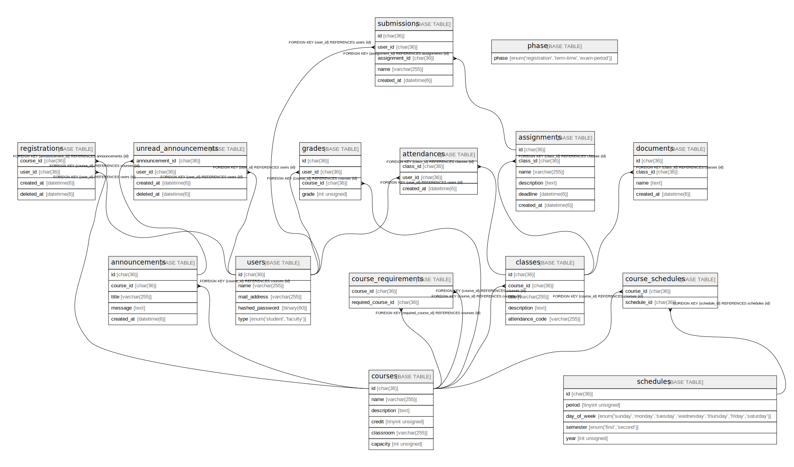

# isucholar

## Tables

| Name                                            | Columns | Comment            | Type       |
| ----------------------------------------------- | ------- | ------------------ | ---------- |
| [announcements](announcements.md)               | 5       | お知らせ一覧             | BASE TABLE |
| [classes](classes.md)                           | 7       | 講義一覧               | BASE TABLE |
| [courses](courses.md)                           | 12      | 科目一覧               | BASE TABLE |
| [registrations](registrations.md)               | 4       | 履修登録一覧             | BASE TABLE |
| [submissions](submissions.md)                   | 6       | 提出された課題一覧          | BASE TABLE |
| [unread_announcements](unread_announcements.md) | 4       | 未読お知らせ一覧           | BASE TABLE |
| [users](users.md)                               | 5       | ユーザー一覧             | BASE TABLE |

## Relations

---

> Generated by [tbls](https://github.com/k1LoW/tbls)
