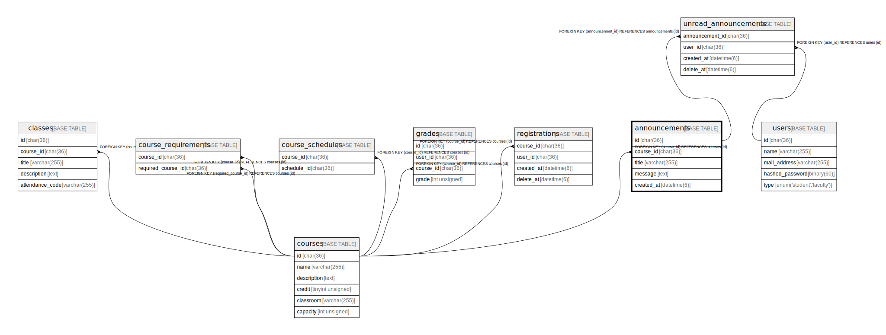

# announcements

## Description

お知らせ一覧

<details>
<summary><strong>Table Definition</strong></summary>

```sql
CREATE TABLE `announcements` (
  `id` char(36) COLLATE utf8mb4_bin NOT NULL,
  `course_id` char(36) COLLATE utf8mb4_bin NOT NULL,
  `title` varchar(255) COLLATE utf8mb4_bin NOT NULL,
  `message` text COLLATE utf8mb4_bin NOT NULL,
  `created_at` datetime(6) NOT NULL,
  PRIMARY KEY (`id`),
  KEY `FK_course_id` (`course_id`),
  CONSTRAINT `announcements_ibfk_1` FOREIGN KEY (`course_id`) REFERENCES `courses` (`id`)
) ENGINE=InnoDB DEFAULT CHARSET=utf8mb4 COLLATE=utf8mb4_bin
```

</details>

## Columns

| Name       | Type         | Default | Nullable | Children                                        | Parents               | Comment            |
| ---------- | ------------ | ------- | -------- | ----------------------------------------------- | --------------------- | ------------------ |
| id         | char(36)     |         | false    | [unread_announcements](unread_announcements.md) |                       |                    |
| course_id  | char(36)     |         | false    |                                                 | [courses](courses.md) | 科目のID              |
| title      | varchar(255) |         | false    |                                                 |                       | お知らせのタイトル          |
| message    | text         |         | false    |                                                 |                       | お知らせの内容            |
| created_at | datetime(6)  |         | false    |                                                 |                       |                    |

## Constraints

| Name                 | Type        | Definition                                      |
| -------------------- | ----------- | ----------------------------------------------- |
| announcements_ibfk_1 | FOREIGN KEY | FOREIGN KEY (course_id) REFERENCES courses (id) |
| PRIMARY              | PRIMARY KEY | PRIMARY KEY (id)                                |

## Indexes

| Name         | Definition                               |
| ------------ | ---------------------------------------- |
| FK_course_id | KEY FK_course_id (course_id) USING BTREE |
| PRIMARY      | PRIMARY KEY (id) USING BTREE             |

## Relations



---

> Generated by [tbls](https://github.com/k1LoW/tbls)
