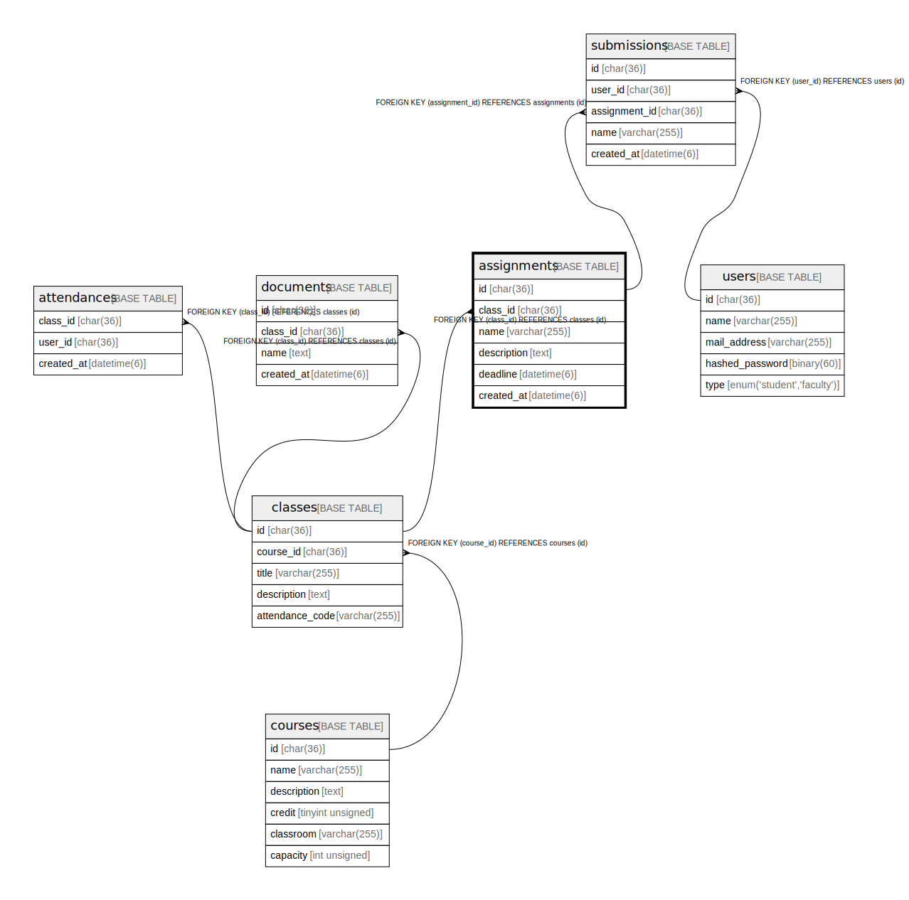

# assignments

## Description

課題一覧

<details>
<summary><strong>Table Definition</strong></summary>

```sql
CREATE TABLE `assignments` (
  `id` char(36) COLLATE utf8mb4_bin NOT NULL,
  `class_id` char(36) COLLATE utf8mb4_bin NOT NULL,
  `name` varchar(255) COLLATE utf8mb4_bin NOT NULL,
  `description` text COLLATE utf8mb4_bin NOT NULL,
  `deadline` datetime(6) NOT NULL,
  `created_at` datetime(6) NOT NULL,
  PRIMARY KEY (`id`),
  KEY `FK_class_id` (`class_id`),
  CONSTRAINT `assignments_ibfk_1` FOREIGN KEY (`class_id`) REFERENCES `classes` (`id`)
) ENGINE=InnoDB DEFAULT CHARSET=utf8mb4 COLLATE=utf8mb4_bin
```

</details>

## Columns

| Name        | Type         | Default | Nullable | Children                      | Parents               | Comment    |
| ----------- | ------------ | ------- | -------- | ----------------------------- | --------------------- | ---------- |
| id          | char(36)     |         | false    | [submissions](submissions.md) |                       |            |
| class_id    | char(36)     |         | false    |                               | [classes](classes.md) | 講義のID      |
| name        | varchar(255) |         | false    |                               |                       | 課題名        |
| description | text         |         | false    |                               |                       | 課題の説明      |
| deadline    | datetime(6)  |         | false    |                               |                       | 提出期限       |
| created_at  | datetime(6)  |         | false    |                               |                       |            |

## Constraints

| Name               | Type        | Definition                                     |
| ------------------ | ----------- | ---------------------------------------------- |
| assignments_ibfk_1 | FOREIGN KEY | FOREIGN KEY (class_id) REFERENCES classes (id) |
| PRIMARY            | PRIMARY KEY | PRIMARY KEY (id)                               |

## Indexes

| Name        | Definition                             |
| ----------- | -------------------------------------- |
| FK_class_id | KEY FK_class_id (class_id) USING BTREE |
| PRIMARY     | PRIMARY KEY (id) USING BTREE           |

## Relations



---

> Generated by [tbls](https://github.com/k1LoW/tbls)
