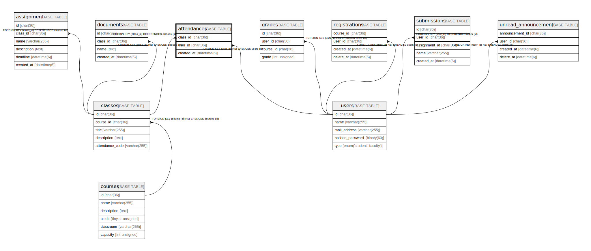

# attendances

## Description

出席履歴

<details>
<summary><strong>Table Definition</strong></summary>

```sql
CREATE TABLE `attendances` (
  `class_id` char(36) COLLATE utf8mb4_bin NOT NULL,
  `user_id` char(36) COLLATE utf8mb4_bin NOT NULL,
  `created_at` datetime(6) NOT NULL,
  PRIMARY KEY (`class_id`,`user_id`),
  KEY `FK_user_id` (`user_id`),
  CONSTRAINT `attendances_ibfk_1` FOREIGN KEY (`class_id`) REFERENCES `classes` (`id`),
  CONSTRAINT `attendances_ibfk_2` FOREIGN KEY (`user_id`) REFERENCES `users` (`id`)
) ENGINE=InnoDB DEFAULT CHARSET=utf8mb4 COLLATE=utf8mb4_bin
```

</details>

## Columns

| Name       | Type        | Default | Nullable | Children | Parents               | Comment          |
| ---------- | ----------- | ------- | -------- | -------- | --------------------- | ---------------- |
| class_id   | char(36)    |         | false    |          | [classes](classes.md) | 講義のID            |
| user_id    | char(36)    |         | false    |          | [users](users.md)     | 出席した学生のID        |
| created_at | datetime(6) |         | false    |          |                       |                  |

## Constraints

| Name               | Type        | Definition                                     |
| ------------------ | ----------- | ---------------------------------------------- |
| attendances_ibfk_1 | FOREIGN KEY | FOREIGN KEY (class_id) REFERENCES classes (id) |
| attendances_ibfk_2 | FOREIGN KEY | FOREIGN KEY (user_id) REFERENCES users (id)    |
| PRIMARY            | PRIMARY KEY | PRIMARY KEY (class_id, user_id)                |

## Indexes

| Name       | Definition                                  |
| ---------- | ------------------------------------------- |
| FK_user_id | KEY FK_user_id (user_id) USING BTREE        |
| PRIMARY    | PRIMARY KEY (class_id, user_id) USING BTREE |

## Relations



---

> Generated by [tbls](https://github.com/k1LoW/tbls)
