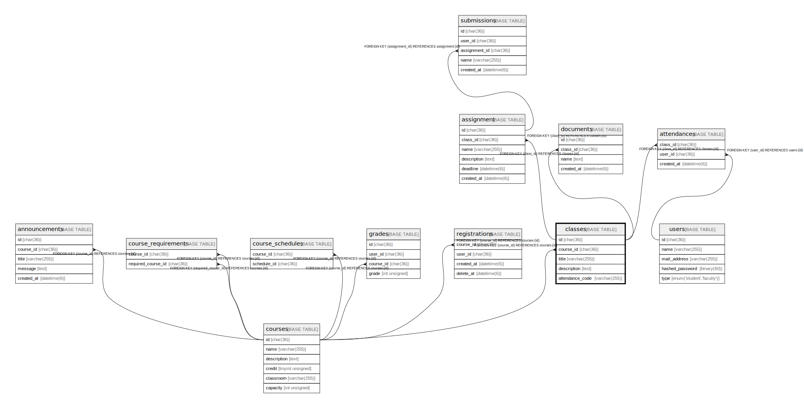

# classes

## Description

講義一覧

<details>
<summary><strong>Table Definition</strong></summary>

```sql
CREATE TABLE `classes` (
  `id` char(36) COLLATE utf8mb4_bin NOT NULL,
  `course_id` char(36) COLLATE utf8mb4_bin NOT NULL,
  `part` tinyint unsigned NOT NULL,
  `title` varchar(255) COLLATE utf8mb4_bin NOT NULL,
  `description` text COLLATE utf8mb4_bin NOT NULL,
  `created_at` datetime NOT NULL,
  `submission_closed_at` datetime DEFAULT NULL,
  PRIMARY KEY (`id`),
  KEY `FK_classes_course_id` (`course_id`),
  CONSTRAINT `FK_classes_course_id` FOREIGN KEY (`course_id`) REFERENCES `courses` (`id`)
) ENGINE=InnoDB DEFAULT CHARSET=utf8mb4 COLLATE=utf8mb4_bin
```

</details>

## Columns

| Name                 | Type             | Default | Nullable | Children                      | Parents               | Comment                        |
| -------------------- | ---------------- | ------- | -------- | ----------------------------- | --------------------- | ------------------------------ |
| id                   | char(36)         |         | false    | [submissions](submissions.md) |                       |                                |
| course_id            | char(36)         |         | false    |                               | [courses](courses.md) | 科目のID                          |
| part                 | tinyint unsigned |         | false    |                               |                       | 講義の順序                          |
| title                | varchar(255)     |         | false    |                               |                       | 講義のタイトル                        |
| description          | text             |         | false    |                               |                       | 講義の説明                          |
| created_at           | datetime         |         | false    |                               |                       |                                |
| submission_closed_at | datetime         |         | true     |                               |                       | 課題締め切り時のタイムスタンプ                |

## Constraints

| Name                 | Type        | Definition                                      |
| -------------------- | ----------- | ----------------------------------------------- |
| FK_classes_course_id | FOREIGN KEY | FOREIGN KEY (course_id) REFERENCES courses (id) |
| PRIMARY              | PRIMARY KEY | PRIMARY KEY (id)                                |

## Indexes

| Name                 | Definition                                       |
| -------------------- | ------------------------------------------------ |
| FK_classes_course_id | KEY FK_classes_course_id (course_id) USING BTREE |
| PRIMARY              | PRIMARY KEY (id) USING BTREE                     |

## Relations



---

> Generated by [tbls](https://github.com/k1LoW/tbls)
