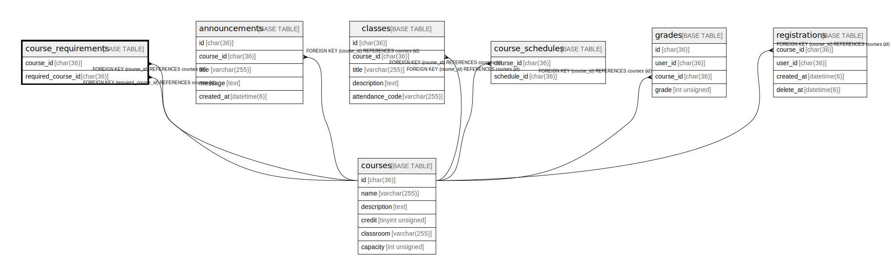

# course_requirements

## Description

受講に必要な科目一覧

<details>
<summary><strong>Table Definition</strong></summary>

```sql
CREATE TABLE `course_requirements` (
  `course_id` char(36) COLLATE utf8mb4_bin NOT NULL,
  `required_course_id` char(36) COLLATE utf8mb4_bin NOT NULL,
  PRIMARY KEY (`course_id`,`required_course_id`),
  KEY `FK_course_requirements_required_course_id` (`required_course_id`),
  CONSTRAINT `FK_course_requirements_course_id` FOREIGN KEY (`course_id`) REFERENCES `courses` (`id`),
  CONSTRAINT `FK_course_requirements_required_course_id` FOREIGN KEY (`required_course_id`) REFERENCES `courses` (`id`)
) ENGINE=InnoDB DEFAULT CHARSET=utf8mb4 COLLATE=utf8mb4_bin
```

</details>

## Columns

| Name               | Type     | Default | Nullable | Children | Parents               | Comment                    |
| ------------------ | -------- | ------- | -------- | -------- | --------------------- | -------------------------- |
| course_id          | char(36) |         | false    |          | [courses](courses.md) | 履修科目                       |
| required_course_id | char(36) |         | false    |          | [courses](courses.md) | 先に履修する必要がある科目              |

## Constraints

| Name                                      | Type        | Definition                                               |
| ----------------------------------------- | ----------- | -------------------------------------------------------- |
| FK_course_requirements_course_id          | FOREIGN KEY | FOREIGN KEY (course_id) REFERENCES courses (id)          |
| FK_course_requirements_required_course_id | FOREIGN KEY | FOREIGN KEY (required_course_id) REFERENCES courses (id) |
| PRIMARY                                   | PRIMARY KEY | PRIMARY KEY (course_id, required_course_id)              |

## Indexes

| Name                                      | Definition                                                                     |
| ----------------------------------------- | ------------------------------------------------------------------------------ |
| FK_course_requirements_required_course_id | KEY FK_course_requirements_required_course_id (required_course_id) USING BTREE |
| PRIMARY                                   | PRIMARY KEY (course_id, required_course_id) USING BTREE                        |

## Relations



---

> Generated by [tbls](https://github.com/k1LoW/tbls)
