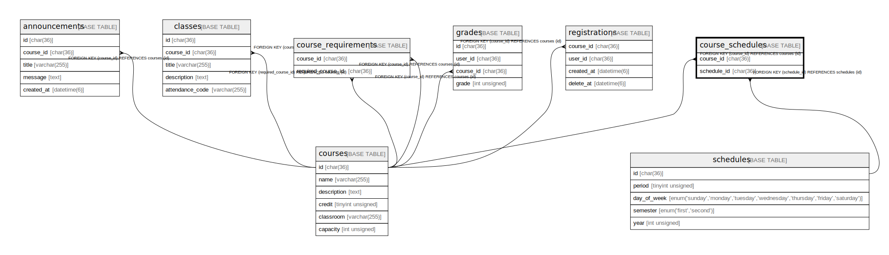

# course_schedules

## Description

科目の時間割対応一覧

<details>
<summary><strong>Table Definition</strong></summary>

```sql
CREATE TABLE `course_schedules` (
  `course_id` char(36) COLLATE utf8mb4_bin NOT NULL,
  `schedule_id` char(36) COLLATE utf8mb4_bin NOT NULL,
  PRIMARY KEY (`course_id`,`schedule_id`),
  KEY `FK_schedule_id` (`schedule_id`),
  CONSTRAINT `course_schedules_ibfk_1` FOREIGN KEY (`course_id`) REFERENCES `courses` (`id`),
  CONSTRAINT `course_schedules_ibfk_2` FOREIGN KEY (`schedule_id`) REFERENCES `schedules` (`id`)
) ENGINE=InnoDB DEFAULT CHARSET=utf8mb4 COLLATE=utf8mb4_bin
```

</details>

## Columns

| Name        | Type     | Default | Nullable | Children | Parents                   | Comment    |
| ----------- | -------- | ------- | -------- | -------- | ------------------------- | ---------- |
| course_id   | char(36) |         | false    |          | [courses](courses.md)     | 科目のID      |
| schedule_id | char(36) |         | false    |          | [schedules](schedules.md) | 時間割のID     |

## Constraints

| Name                    | Type        | Definition                                          |
| ----------------------- | ----------- | --------------------------------------------------- |
| course_schedules_ibfk_1 | FOREIGN KEY | FOREIGN KEY (course_id) REFERENCES courses (id)     |
| course_schedules_ibfk_2 | FOREIGN KEY | FOREIGN KEY (schedule_id) REFERENCES schedules (id) |
| PRIMARY                 | PRIMARY KEY | PRIMARY KEY (course_id, schedule_id)                |

## Indexes

| Name           | Definition                                       |
| -------------- | ------------------------------------------------ |
| FK_schedule_id | KEY FK_schedule_id (schedule_id) USING BTREE     |
| PRIMARY        | PRIMARY KEY (course_id, schedule_id) USING BTREE |

## Relations



---

> Generated by [tbls](https://github.com/k1LoW/tbls)
