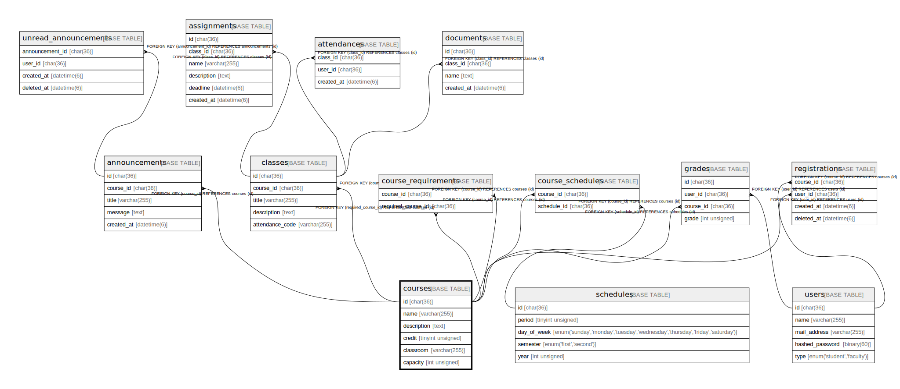

# courses

## Description

科目一覧

<details>
<summary><strong>Table Definition</strong></summary>

```sql
CREATE TABLE `courses` (
  `id` char(36) COLLATE utf8mb4_bin NOT NULL,
  `code` varchar(255) COLLATE utf8mb4_bin NOT NULL,
  `type` enum('liberal-arts','major-subjects') COLLATE utf8mb4_bin NOT NULL,
  `name` varchar(255) COLLATE utf8mb4_bin NOT NULL,
  `description` text COLLATE utf8mb4_bin NOT NULL,
  `credit` tinyint unsigned NOT NULL,
  `period` tinyint unsigned NOT NULL,
  `day_of_week` enum('sunday','monday','tuesday','wednesday','thursday','friday','saturday') COLLATE utf8mb4_bin NOT NULL,
  `teacher_id` char(36) COLLATE utf8mb4_bin NOT NULL,
  `keywords` text COLLATE utf8mb4_bin NOT NULL,
  `status` enum('registration','in-progress','closed') COLLATE utf8mb4_bin NOT NULL DEFAULT 'registration',
  `created_at` datetime NOT NULL,
  PRIMARY KEY (`id`),
  UNIQUE KEY `code` (`code`),
  KEY `FK_courses_teacher_id` (`teacher_id`),
  CONSTRAINT `FK_courses_teacher_id` FOREIGN KEY (`teacher_id`) REFERENCES `users` (`id`)
) ENGINE=InnoDB DEFAULT CHARSET=utf8mb4 COLLATE=utf8mb4_bin
```

</details>

## Columns

| Name        | Type                                                                         | Default      | Nullable | Children                                                                                  | Parents           | Comment        |
| ----------- | ---------------------------------------------------------------------------- | ------------ | -------- | ----------------------------------------------------------------------------------------- | ----------------- | -------------- |
| id          | char(36)                                                                     |              | false    | [announcements](announcements.md) [classes](classes.md) [registrations](registrations.md) |                   |                |
| code        | varchar(255)                                                                 |              | false    |                                                                                           |                   | 科目コード          |
| type        | enum('liberal-arts','major-subjects')                                        |              | false    |                                                                                           |                   | 科目種別           |
| name        | varchar(255)                                                                 |              | false    |                                                                                           |                   | 科目名            |
| description | text                                                                         |              | false    |                                                                                           |                   | 科目の説明          |
| credit      | tinyint unsigned                                                             |              | false    |                                                                                           |                   | 単位数            |
| period      | tinyint unsigned                                                             |              | false    |                                                                                           |                   | 開講時限           |
| day_of_week | enum('sunday','monday','tuesday','wednesday','thursday','friday','saturday') |              | false    |                                                                                           |                   | 開講曜日           |
| teacher_id  | char(36)                                                                     |              | false    |                                                                                           | [users](users.md) | 担当教員のID        |
| keywords    | text                                                                         |              | false    |                                                                                           |                   | キーワード          |
| status      | enum('registration','in-progress','closed')                                  | registration | false    |                                                                                           |                   | 科目ステータス        |
| created_at  | datetime                                                                     |              | false    |                                                                                           |                   |                |

## Constraints

| Name                  | Type        | Definition                                     |
| --------------------- | ----------- | ---------------------------------------------- |
| code                  | UNIQUE      | UNIQUE KEY code (code)                         |
| FK_courses_teacher_id | FOREIGN KEY | FOREIGN KEY (teacher_id) REFERENCES users (id) |
| PRIMARY               | PRIMARY KEY | PRIMARY KEY (id)                               |

## Indexes

| Name                  | Definition                                         |
| --------------------- | -------------------------------------------------- |
| FK_courses_teacher_id | KEY FK_courses_teacher_id (teacher_id) USING BTREE |
| PRIMARY               | PRIMARY KEY (id) USING BTREE                       |
| code                  | UNIQUE KEY code (code) USING BTREE                 |

## Relations



---

> Generated by [tbls](https://github.com/k1LoW/tbls)
