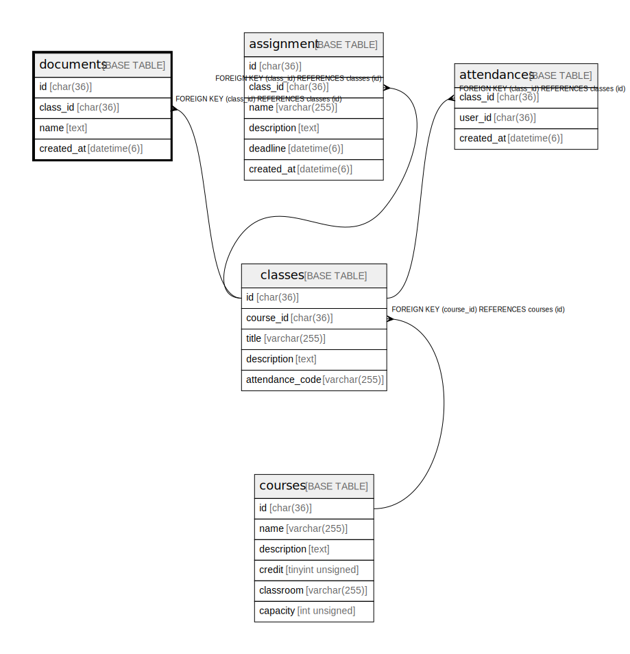

# documents

## Description

講義資料一覧

<details>
<summary><strong>Table Definition</strong></summary>

```sql
CREATE TABLE `documents` (
  `id` char(36) COLLATE utf8mb4_bin NOT NULL,
  `class_id` char(36) COLLATE utf8mb4_bin NOT NULL,
  `name` text COLLATE utf8mb4_bin NOT NULL,
  `created_at` datetime(6) NOT NULL,
  PRIMARY KEY (`id`),
  KEY `FK_class_id` (`class_id`),
  CONSTRAINT `documents_ibfk_1` FOREIGN KEY (`class_id`) REFERENCES `classes` (`id`)
) ENGINE=InnoDB DEFAULT CHARSET=utf8mb4 COLLATE=utf8mb4_bin
```

</details>

## Columns

| Name       | Type        | Default | Nullable | Children | Parents               | Comment          |
| ---------- | ----------- | ------- | -------- | -------- | --------------------- | ---------------- |
| id         | char(36)    |         | false    |          |                       |                  |
| class_id   | char(36)    |         | false    |          | [classes](classes.md) | 講義のID            |
| name       | text        |         | false    |          |                       | 資料のファイル名         |
| created_at | datetime(6) |         | false    |          |                       |                  |

## Constraints

| Name             | Type        | Definition                                     |
| ---------------- | ----------- | ---------------------------------------------- |
| documents_ibfk_1 | FOREIGN KEY | FOREIGN KEY (class_id) REFERENCES classes (id) |
| PRIMARY          | PRIMARY KEY | PRIMARY KEY (id)                               |

## Indexes

| Name        | Definition                             |
| ----------- | -------------------------------------- |
| FK_class_id | KEY FK_class_id (class_id) USING BTREE |
| PRIMARY     | PRIMARY KEY (id) USING BTREE           |

## Relations



---

> Generated by [tbls](https://github.com/k1LoW/tbls)
