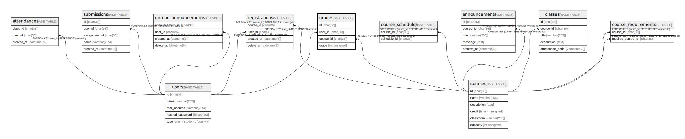

# grades

## Description

学生の科目別成績一覧

<details>
<summary><strong>Table Definition</strong></summary>

```sql
CREATE TABLE `grades` (
  `id` char(36) COLLATE utf8mb4_bin NOT NULL,
  `user_id` char(36) COLLATE utf8mb4_bin NOT NULL,
  `course_id` char(36) COLLATE utf8mb4_bin NOT NULL,
  `grade` int unsigned NOT NULL,
  PRIMARY KEY (`id`),
  KEY `FK_user_id` (`user_id`),
  KEY `FK_course_id` (`course_id`),
  CONSTRAINT `grades_ibfk_1` FOREIGN KEY (`user_id`) REFERENCES `users` (`id`),
  CONSTRAINT `grades_ibfk_2` FOREIGN KEY (`course_id`) REFERENCES `courses` (`id`)
) ENGINE=InnoDB DEFAULT CHARSET=utf8mb4 COLLATE=utf8mb4_bin
```

</details>

## Columns

| Name      | Type         | Default | Nullable | Children | Parents               | Comment      |
| --------- | ------------ | ------- | -------- | -------- | --------------------- | ------------ |
| id        | char(36)     |         | false    |          |                       |              |
| user_id   | char(36)     |         | false    |          | [users](users.md)     | 学生のID        |
| course_id | char(36)     |         | false    |          | [courses](courses.md) | 履修科目のID      |
| grade     | int unsigned |         | false    |          |                       | 成績           |

## Constraints

| Name          | Type        | Definition                                      |
| ------------- | ----------- | ----------------------------------------------- |
| grades_ibfk_1 | FOREIGN KEY | FOREIGN KEY (user_id) REFERENCES users (id)     |
| grades_ibfk_2 | FOREIGN KEY | FOREIGN KEY (course_id) REFERENCES courses (id) |
| PRIMARY       | PRIMARY KEY | PRIMARY KEY (id)                                |

## Indexes

| Name         | Definition                               |
| ------------ | ---------------------------------------- |
| FK_course_id | KEY FK_course_id (course_id) USING BTREE |
| FK_user_id   | KEY FK_user_id (user_id) USING BTREE     |
| PRIMARY      | PRIMARY KEY (id) USING BTREE             |

## Relations



---

> Generated by [tbls](https://github.com/k1LoW/tbls)
