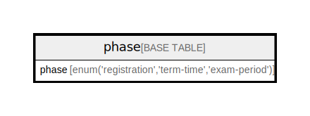

# phase

## Description

単一のレコードに現在のフェーズを保持する。

<details>
<summary><strong>Table Definition</strong></summary>

```sql
CREATE TABLE `phase` (
  `phase` enum('registration','term-time','exam-period') COLLATE utf8mb4_bin DEFAULT 'registration'
) ENGINE=InnoDB DEFAULT CHARSET=utf8mb4 COLLATE=utf8mb4_bin
```

</details>

## Columns

| Name  | Type                                           | Default      | Nullable | Children | Parents | Comment                                                                          |
| ----- | ---------------------------------------------- | ------------ | -------- | -------- | ------- | -------------------------------------------------------------------------------- |
| phase | enum('registration','term-time','exam-period') | registration | true     |          |         | 履修登録期間(Registration)、授業期間(term-time)、試験期間(exam-period)のいずれか                      |

## Relations



---

> Generated by [tbls](https://github.com/k1LoW/tbls)
