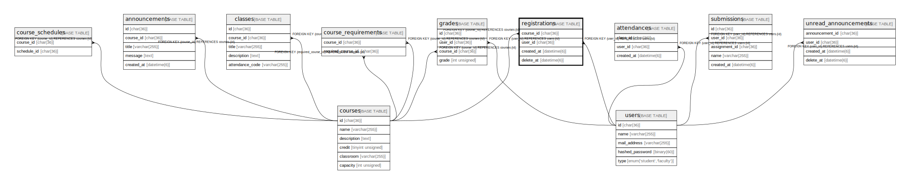

# registrations

## Description

履修登録一覧

<details>
<summary><strong>Table Definition</strong></summary>

```sql
CREATE TABLE `registrations` (
  `course_id` char(36) COLLATE utf8mb4_bin NOT NULL,
  `user_id` char(36) COLLATE utf8mb4_bin NOT NULL,
  `created_at` datetime(6) NOT NULL,
  PRIMARY KEY (`course_id`,`user_id`),
  KEY `FK_registrations_user_id` (`user_id`),
  CONSTRAINT `FK_registrations_course_id` FOREIGN KEY (`course_id`) REFERENCES `courses` (`id`),
  CONSTRAINT `FK_registrations_user_id` FOREIGN KEY (`user_id`) REFERENCES `users` (`id`)
) ENGINE=InnoDB DEFAULT CHARSET=utf8mb4 COLLATE=utf8mb4_bin
```

</details>

## Columns

| Name       | Type        | Default | Nullable | Children | Parents               | Comment      |
| ---------- | ----------- | ------- | -------- | -------- | --------------------- | ------------ |
| course_id  | char(36)    |         | false    |          | [courses](courses.md) | 履修科目のID      |
| user_id    | char(36)    |         | false    |          | [users](users.md)     | 学生のID        |
| created_at | datetime(6) |         | false    |          |                       |              |

## Constraints

| Name                       | Type        | Definition                                      |
| -------------------------- | ----------- | ----------------------------------------------- |
| FK_registrations_course_id | FOREIGN KEY | FOREIGN KEY (course_id) REFERENCES courses (id) |
| FK_registrations_user_id   | FOREIGN KEY | FOREIGN KEY (user_id) REFERENCES users (id)     |
| PRIMARY                    | PRIMARY KEY | PRIMARY KEY (course_id, user_id)                |

## Indexes

| Name                     | Definition                                         |
| ------------------------ | -------------------------------------------------- |
| FK_registrations_user_id | KEY FK_registrations_user_id (user_id) USING BTREE |
| PRIMARY                  | PRIMARY KEY (course_id, user_id) USING BTREE       |

## Relations



---

> Generated by [tbls](https://github.com/k1LoW/tbls)
