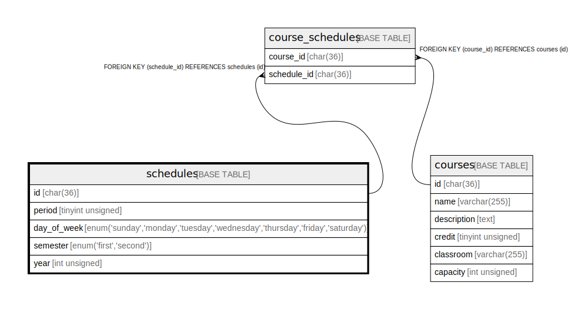

# schedules

## Description

時間割で使用する単位区分

<details>
<summary><strong>Table Definition</strong></summary>

```sql
CREATE TABLE `schedules` (
  `id` char(36) COLLATE utf8mb4_bin NOT NULL,
  `period` tinyint unsigned NOT NULL,
  `day_of_week` enum('sunday','monday','tuesday','wednesday','thursday','friday','saturday') COLLATE utf8mb4_bin NOT NULL,
  `semester` enum('first','second') COLLATE utf8mb4_bin NOT NULL,
  `year` smallint unsigned NOT NULL,
  PRIMARY KEY (`id`)
) ENGINE=InnoDB DEFAULT CHARSET=utf8mb4 COLLATE=utf8mb4_bin
```

</details>

## Columns

| Name        | Type                                                                         | Default | Nullable | Children                                | Parents | Comment          |
| ----------- | ---------------------------------------------------------------------------- | ------- | -------- | --------------------------------------- | ------- | ---------------- |
| id          | char(36)                                                                     |         | false    | [course_schedules](course_schedules.md) |         |                  |
| period      | tinyint unsigned                                                             |         | false    |                                         |         | 時限(1限〜5限)        |
| day_of_week | enum('sunday','monday','tuesday','wednesday','thursday','friday','saturday') |         | false    |                                         |         | 曜日               |
| semester    | enum('first','second')                                                       |         | false    |                                         |         | 学期(前期・後期)        |
| year        | smallint unsigned                                                            |         | false    |                                         |         | 年度               |

## Constraints

| Name    | Type        | Definition       |
| ------- | ----------- | ---------------- |
| PRIMARY | PRIMARY KEY | PRIMARY KEY (id) |

## Indexes

| Name    | Definition                   |
| ------- | ---------------------------- |
| PRIMARY | PRIMARY KEY (id) USING BTREE |

## Relations



---

> Generated by [tbls](https://github.com/k1LoW/tbls)
