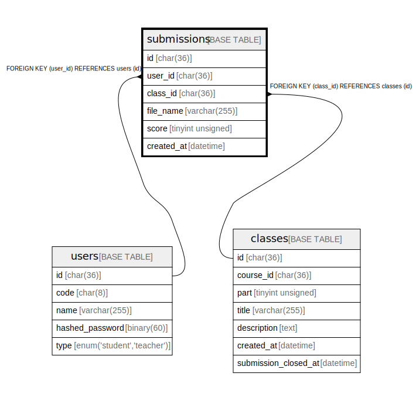

# submissions

## Description

提出された課題一覧

<details>
<summary><strong>Table Definition</strong></summary>

```sql
CREATE TABLE `submissions` (
  `id` char(36) COLLATE utf8mb4_bin NOT NULL,
  `user_id` char(36) COLLATE utf8mb4_bin NOT NULL,
  `assignment_id` char(36) COLLATE utf8mb4_bin NOT NULL,
  `name` varchar(255) COLLATE utf8mb4_bin NOT NULL,
  `created_at` datetime(6) NOT NULL,
  PRIMARY KEY (`id`),
  KEY `FK_user_id` (`user_id`),
  KEY `FK_assignment_id` (`assignment_id`),
  CONSTRAINT `submissions_ibfk_1` FOREIGN KEY (`user_id`) REFERENCES `users` (`id`),
  CONSTRAINT `submissions_ibfk_2` FOREIGN KEY (`assignment_id`) REFERENCES `assignments` (`id`)
) ENGINE=InnoDB DEFAULT CHARSET=utf8mb4 COLLATE=utf8mb4_bin
```

</details>

## Columns

| Name          | Type         | Default | Nullable | Children | Parents                       | Comment            |
| ------------- | ------------ | ------- | -------- | -------- | ----------------------------- | ------------------ |
| id            | char(36)     |         | false    |          |                               |                    |
| user_id       | char(36)     |         | false    |          | [users](users.md)             | 提出した学生のID          |
| assignment_id | char(36)     |         | false    |          | [assignments](assignments.md) | 対象課題のID            |
| name          | varchar(255) |         | false    |          |                               | 提出したファイル名          |
| created_at    | datetime(6)  |         | false    |          |                               |                    |

## Constraints

| Name               | Type        | Definition                                              |
| ------------------ | ----------- | ------------------------------------------------------- |
| PRIMARY            | PRIMARY KEY | PRIMARY KEY (id)                                        |
| submissions_ibfk_1 | FOREIGN KEY | FOREIGN KEY (user_id) REFERENCES users (id)             |
| submissions_ibfk_2 | FOREIGN KEY | FOREIGN KEY (assignment_id) REFERENCES assignments (id) |

## Indexes

| Name             | Definition                                       |
| ---------------- | ------------------------------------------------ |
| FK_assignment_id | KEY FK_assignment_id (assignment_id) USING BTREE |
| FK_user_id       | KEY FK_user_id (user_id) USING BTREE             |
| PRIMARY          | PRIMARY KEY (id) USING BTREE                     |

## Relations



---

> Generated by [tbls](https://github.com/k1LoW/tbls)
