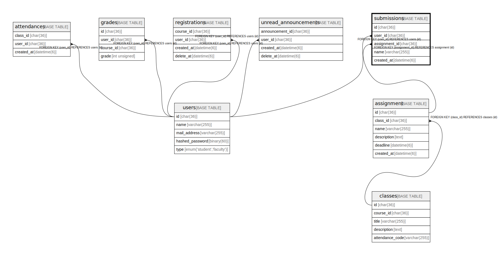

# submissions

## Description

提出された課題一覧

<details>
<summary><strong>Table Definition</strong></summary>

```sql
CREATE TABLE `submissions` (
  `id` char(36) COLLATE utf8mb4_bin NOT NULL,
  `user_id` char(36) COLLATE utf8mb4_bin NOT NULL,
  `class_id` char(36) COLLATE utf8mb4_bin NOT NULL,
  `file_name` varchar(255) COLLATE utf8mb4_bin NOT NULL,
  `score` tinyint unsigned DEFAULT NULL,
  `created_at` datetime NOT NULL,
  PRIMARY KEY (`id`),
  KEY `FK_submissions_user_id` (`user_id`),
  KEY `FK_submissions_class_id` (`class_id`),
  CONSTRAINT `FK_submissions_class_id` FOREIGN KEY (`class_id`) REFERENCES `classes` (`id`),
  CONSTRAINT `FK_submissions_user_id` FOREIGN KEY (`user_id`) REFERENCES `users` (`id`)
) ENGINE=InnoDB DEFAULT CHARSET=utf8mb4 COLLATE=utf8mb4_bin
```

</details>

## Columns

| Name       | Type             | Default | Nullable | Children | Parents               | Comment            |
| ---------- | ---------------- | ------- | -------- | -------- | --------------------- | ------------------ |
| id         | char(36)         |         | false    |          |                       |                    |
| user_id    | char(36)         |         | false    |          | [users](users.md)     | 提出した学生のID          |
| class_id   | char(36)         |         | false    |          | [classes](classes.md) | 対象講義のID            |
| file_name  | varchar(255)     |         | false    |          |                       | 提出したファイル名          |
| score      | tinyint unsigned |         | true     |          |                       | 課題のスコア             |
| created_at | datetime         |         | false    |          |                       |                    |

## Constraints

| Name                    | Type        | Definition                                     |
| ----------------------- | ----------- | ---------------------------------------------- |
| FK_submissions_class_id | FOREIGN KEY | FOREIGN KEY (class_id) REFERENCES classes (id) |
| FK_submissions_user_id  | FOREIGN KEY | FOREIGN KEY (user_id) REFERENCES users (id)    |
| PRIMARY                 | PRIMARY KEY | PRIMARY KEY (id)                               |

## Indexes

| Name                    | Definition                                         |
| ----------------------- | -------------------------------------------------- |
| FK_submissions_class_id | KEY FK_submissions_class_id (class_id) USING BTREE |
| FK_submissions_user_id  | KEY FK_submissions_user_id (user_id) USING BTREE   |
| PRIMARY                 | PRIMARY KEY (id) USING BTREE                       |

## Relations



---

> Generated by [tbls](https://github.com/k1LoW/tbls)
