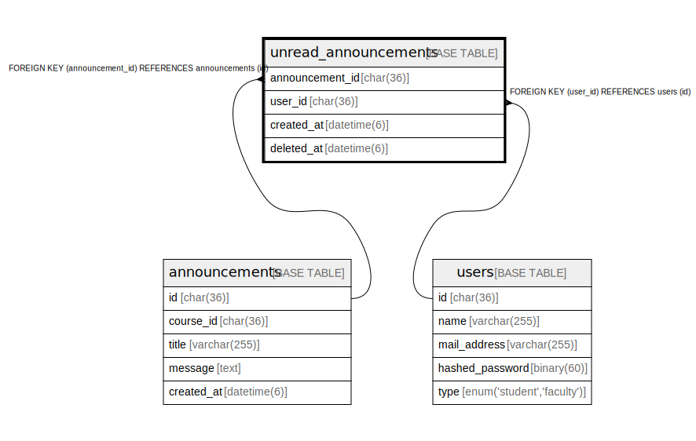

# unread_announcements

## Description

未読お知らせ一覧

<details>
<summary><strong>Table Definition</strong></summary>

```sql
CREATE TABLE `unread_announcements` (
  `announcement_id` char(36) COLLATE utf8mb4_bin NOT NULL,
  `user_id` char(36) COLLATE utf8mb4_bin NOT NULL,
  `created_at` datetime(6) NOT NULL,
  `delete_at` datetime(6) DEFAULT NULL,
  PRIMARY KEY (`announcement_id`,`user_id`),
  KEY `FK_user_id` (`user_id`),
  CONSTRAINT `unread_announcements_ibfk_1` FOREIGN KEY (`announcement_id`) REFERENCES `announcements` (`id`),
  CONSTRAINT `unread_announcements_ibfk_2` FOREIGN KEY (`user_id`) REFERENCES `users` (`id`)
) ENGINE=InnoDB DEFAULT CHARSET=utf8mb4 COLLATE=utf8mb4_bin
```

</details>

## Columns

| Name            | Type        | Default | Nullable | Children | Parents                           | Comment                |
| --------------- | ----------- | ------- | -------- | -------- | --------------------------------- | ---------------------- |
| announcement_id | char(36)    |         | false    |          | [announcements](announcements.md) | お知らせのID                |
| user_id         | char(36)    |         | false    |          | [users](users.md)                 | 未読の学生                  |
| created_at      | datetime(6) |         | false    |          |                                   |                        |
| delete_at       | datetime(6) |         | true     |          |                                   | 既読時のタイムスタンプ            |

## Constraints

| Name                        | Type        | Definition                                                  |
| --------------------------- | ----------- | ----------------------------------------------------------- |
| PRIMARY                     | PRIMARY KEY | PRIMARY KEY (announcement_id, user_id)                      |
| unread_announcements_ibfk_1 | FOREIGN KEY | FOREIGN KEY (announcement_id) REFERENCES announcements (id) |
| unread_announcements_ibfk_2 | FOREIGN KEY | FOREIGN KEY (user_id) REFERENCES users (id)                 |

## Indexes

| Name       | Definition                                         |
| ---------- | -------------------------------------------------- |
| FK_user_id | KEY FK_user_id (user_id) USING BTREE               |
| PRIMARY    | PRIMARY KEY (announcement_id, user_id) USING BTREE |

## Relations



---

> Generated by [tbls](https://github.com/k1LoW/tbls)
