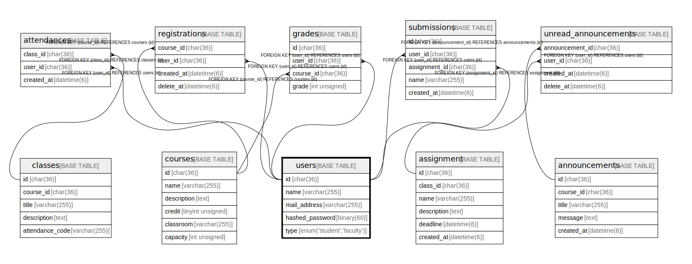

# users

## Description

ユーザー一覧

<details>
<summary><strong>Table Definition</strong></summary>

```sql
CREATE TABLE `users` (
  `id` char(36) COLLATE utf8mb4_bin NOT NULL,
  `code` char(8) COLLATE utf8mb4_bin NOT NULL,
  `name` varchar(255) COLLATE utf8mb4_bin NOT NULL,
  `hashed_password` binary(60) NOT NULL,
  `type` enum('student','teacher') COLLATE utf8mb4_bin NOT NULL,
  PRIMARY KEY (`id`),
  UNIQUE KEY `code` (`code`)
) ENGINE=InnoDB DEFAULT CHARSET=utf8mb4 COLLATE=utf8mb4_bin
```

</details>

## Columns

| Name            | Type                      | Default | Nullable | Children                                                                                                                              | Parents | Comment                |
| --------------- | ------------------------- | ------- | -------- | ------------------------------------------------------------------------------------------------------------------------------------- | ------- | ---------------------- |
| id              | char(36)                  |         | false    | [courses](courses.md) [registrations](registrations.md) [submissions](submissions.md) [unread_announcements](unread_announcements.md) |         |                        |
| code            | char(8)                   |         | false    |                                                                                                                                       |         | 学籍番号                   |
| name            | varchar(255)              |         | false    |                                                                                                                                       |         | ユーザー名                  |
| hashed_password | binary(60)                |         | false    |                                                                                                                                       |         | 暗号化されたパスワード            |
| type            | enum('student','teacher') |         | false    |                                                                                                                                       |         | 学生・教員                  |

## Constraints

| Name    | Type        | Definition             |
| ------- | ----------- | ---------------------- |
| code    | UNIQUE      | UNIQUE KEY code (code) |
| PRIMARY | PRIMARY KEY | PRIMARY KEY (id)       |

## Indexes

| Name    | Definition                         |
| ------- | ---------------------------------- |
| PRIMARY | PRIMARY KEY (id) USING BTREE       |
| code    | UNIQUE KEY code (code) USING BTREE |

## Relations



---

> Generated by [tbls](https://github.com/k1LoW/tbls)
